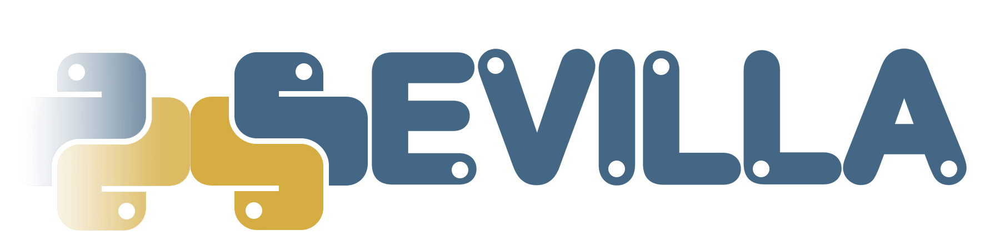

logo by: [@rageraouiea](https://twitter.com/rageraouiea)

# Python Sevilla Meetups
List of Python Sevilla talks:

### Recommender Systems: Machine Learning for the Web.
By [@josemazo](https://github.com/josemazo)
- https://github.com/python-sevilla/recommender-systems
- Slides: https://rawgit.com/python-sevilla/recommender-systems/master/slides.pdf
- Video session: https://www.youtube.com/watch?v=P4pfod9ibHU

### Python & MOOC (Massive Online Open Courses).
Talks:
- __Open edX: first steps__. By [@ilozano2](https://twitter.com/ilozano2)

- __OpenMOOC: Python MOOCs made in Sevilla__. By [@neokore](https://github.com/neokore)

Slides:
- [Link to slides](https://github.com/python-sevilla/meetup-python-moocs)

Video Sessions:
- [Part I](https://www.youtube.com/watch?v=pG03M0dhZ_4)
- [Part II](https://www.youtube.com/watch?v=f-uFNKz98hw)

### Python Gotchas.
By [@_amatellanes](https://twitter.com/_amatellanes)
- Slides: https://github.com/python-sevilla/meetup-python-gotchas
- Video session: https://www.youtube.com/watch?v=LXU1zcD6aIA

### Neural encoders - An essential part of Deep Learning.
By [@palmagro](https://github.com/palmagro)
- https://github.com/python-sevilla/neural-encoders
- Slides: https://cdn.rawgit.com/python-sevilla/neural-encoders/master/neural-encoders.pdf
- Video session: https://www.youtube.com/watch?v=IQTQodjr3Go

### Introduction to complex systems and cellular automata (with Python).
By [@DanielLopezCoto](https://github.com/DanielLopezCoto)
- https://github.com/python-sevilla/emergent-computation
- Video session: https://www.youtube.com/watch?v=QVVp9z5dyhU

### Trolling Detection with Scikit-learn and NLTK.
By [@rafaharo](https://github.com/rafaharo)
- https://github.com/python-sevilla/trolling_detection

### Playing with Python.
By [Alfredo Sotelo ](https://es.linkedin.com/in/alfredosotelo)
- http://www.pythonchallenge.com/

### Introduction to geographic data processing with Python.
By [@cayetanobv](https://github.com/cayetanobv) [@alasarr](https://github.com/alasarr)
- https://github.com/python-sevilla/MeetUp_Python_Jan2016
- Slides: https://github.com/python-sevilla/MeetUp_Python_Jan2016/raw/master/doc/Meetup_GeoPython_jan2016.pdf

### Data Science - A Python Introduction.
By [@josemazo](https://github.com/josemazo)
- https://github.com/python-sevilla/nyc-taxi-tip-predictor
- Slides: https://goo.gl/erFIF4
